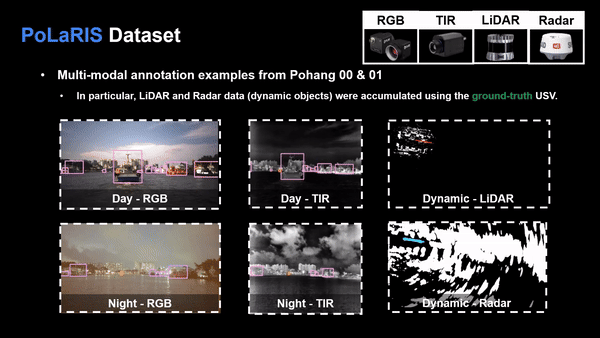

  <h1>PoLaRIS Datasets</h1>
  
   
   
  
**(Under Review) [IEEE ICRA 25]** This repository is the official code for PoLaRIS:A Pohang Canal Object Detection and Tracking Dataset in Maritime Environments.

  <a href="https://scholar.google.com/citations?user=wL8VdUMAAAAJ&hl=ko" target="_blank">Jiwon Choi</a>,
  <a href="" target="_blank">Dongjin Cho</a>,
  <a href="https://scholar.google.com/citations?user=iKsImcYAAAAJ&hl=ko" target="_blank">Gihyeon Lee</a>,
  <a href="https://scholar.google.com/citations?user=t5UEbooAAAAJ&hl=ko" target="_blank">Hogyun Kim</a>,
  <a href="https://scholar.google.com/citations?user=kiBTkqMAAAAJ&hl=ko" target="_blank">Geonmo Yang</a>,
  <a href="https://scholar.google.com/citations?user=W5MOKWIAAAAJ&hl=ko" target="_blank">Younggun Cho</a>†

**[Spatial AI and Robotics Lab (SPARO)](https://sites.google.com/view/sparo/%ED%99%88?authuser=0&pli=1)**

  

    
  

## Acknowledgement
* We appreciate Prof. [Jinhwan Kim](http://morin.kaist.ac.kr/members.html)'s [MORIN group](http://morin.kaist.ac.kr/home.html), particularly [Dongha Chung](https://scholar.google.com/citations?user=bqcPhkUAAAAJ&hl=ko&oi=ao), for publishing the [Pohang Canal Dataset](https://sites.google.com/view/pohang-canal-dataset/home?authuser=0).
  

